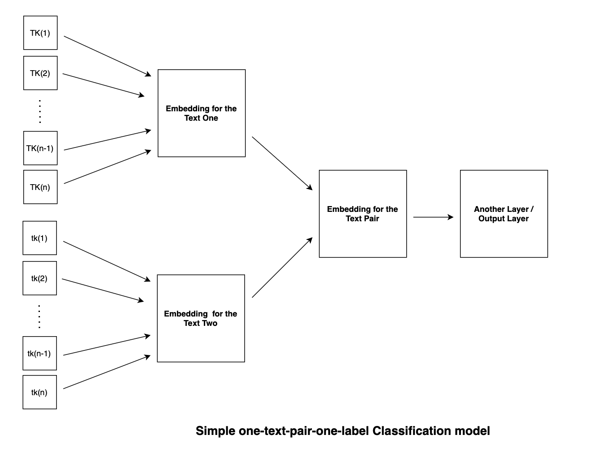
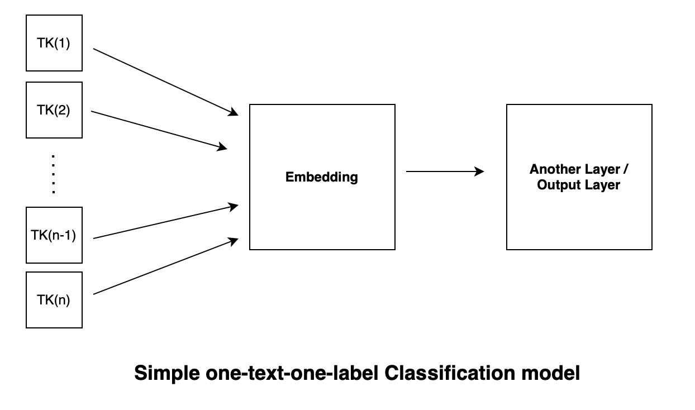

## Description

This repository aims to form intuitions about how to build and train simple deep learning models for text matching classification tasks from scratch using [paddle](https://github.com/PaddlePaddle/Paddle), [PyTorch](https://github.com/pytorch/pytorch), and [TensorFlow](https://github.com/tensorflow/tensorflow). GPUs are not required. 

We will build five deep learning models (BoW, CNN, RNN, LSTM, and GRU, or three types: BoW, CNN, and RNNs) adopting one simple but general architecture. We will also learn the ins and outs of text data preprocessing for training deep learning models using our own methods (which appears to be simpler and easier to learn) as well as common practices advocated by those deep learning frameworks. 

**One interesting fact** about this repository is that, I tried to twist `PyTorch` and `TensorFlow` to fit the way I built the models initially using `paddle`. I find it beneficial for myself to tell the nuances as well as commonalities among different deep learning frameworks, although doing so may not feel easy at first and certainly does not represent the best ways of employing those deep learning frameworks that I twisted. 

This repository is closely related to another repository called [text-classification-explained](https://github.com/jaaack-wang/text-classification-explained). These two repositories are siblings because the baisc architectures for the five models are same except that models constucted here are able to take as inputs two pieces of texts instead of one single text. Therefore, you will simple large amounts of overlaps between these two repositories if you are interested in both. 

The models built here are adapted from the ones I used for my research, titled [Linguistic Knowledge in Data Augmentation for Natural Language Processing: An Example on Chinese Question Matching](https://arxiv.org/abs/2111.14709). Source Code, data, and experimental results can be seen at [this repository](https://github.com/jaaack-wang/linguistic-knowledge-in-DA-for-NLP).

## General architecture

The general architecture for the five models can be illustrated as follows: first, we process the two peices of texts separately in the form of embedding, and then we create another embedding that can represent the embedings of the text pair, and finally this aggregated embedding will go through certain number of layers (can be 0) until it reaches the output layer. 

**Please note that**, 

- Another way to call the first embedding layer (for the text pair) is **representation layer**; and another way to call the second embedding layer is **matching layer**, whichever is easier for you to digest. 
- the arrow means a process, or more specifically a function (let's be philosophical, no function at all is also a function, i.e., f(x)=x) that values from previous layer needs to go through; 
- the number of layers can be arbitrarily large, but our models are basically all four layers (including the input layer, but excluding the inserted CNN, RNNs, which are taken as a function here for illustration).
- There should be many ways to convert two embeddings into one aggregated embedding, but here we simply concatenate them together, meaning [1, 2, 3] + [4, 5, 6] = [1, 2, 3, 4, 5, 6]; [[1, 2, 3]] + [[4, 5, 6]] = [[1, 2, 3], [4, 5, 6]] or [[1, 2, 3, 4, 5, 6]] (dependending one axis you concatenate). Our models do the latter. 
- **The key difference among these models** how the initial two embeddings are processed or **encoded** before they are concatenated together. If you read the source codes for the five models, you can see the **encoders** for the five models what makes a model a model. 

 

If we simplify the model, only take one text as input, and leave out the aggregated embedding layer, then what is left is essentially a general architecture for (one) text (one label) classifcation model!

 

